```mermaid
classDiagram
    class Post {
        -Long postId
        -String conteudo
        -Instant creationTimestamp
        -User user
    }

    class Role {
        -Long roleId
        -String roleName
    }

    class User {
        -UUID id
        -String username
        -String password
        -Set<Role> roles
    }

    class PostController {
        -PostRepository postRepository
        -UserRepository userRepository
        +createPost(CreatePost postDto, JwtAuthenticationToken token)
        +editPost(CreatePost postDtoNew, JwtAuthenticationToken token, Long postId)
        +readPostById(Long postId, JwtAuthenticationToken token)
        +deletePost(Long postId, JwtAuthenticationToken token)
    }

    class TokenController {
        -JwtEncoder jwtEncoder
        -UserRepository userRepository
        -BCryptPasswordEncoder passwordEncoder
        +login(LoginRequest loginRequest)
    }

    class UserController {
        -UserRepository userRepository
        -RoleRepository roleRepository
        -BCryptPasswordEncoder passwordEncoder
        +createUser(CreateUser user)
        +getAllUsers()
    }

    class SecurityConfig {
        -RSAPublicKey publicKey
        -RSAPrivateKey privateKey
        +securityFilterChain(HttpSecurity http)
        +jwtEncoder()
        +jwtDecoder()
        +bCryptPasswordEncoder()
    }

    class CreatePost {
        -String conteudo
    }

    class LoginRequest {
        -String username
        -String password
    }

    class LoginResponse {
        -String token
        -Long expiresIn
    }

    class CreateUser {
        -String username
        -String password
    }

    class PostRepository {
        +save(Post post)
        +deleteById(Long id)
        +findById(Long id)
        +findAll()
    }

    class UserRepository {
        +save(User user)
        +findById(UUID id)
        +findByUsername(String username)
        +findAll()
    }

    class RoleRepository {
        +save(Role role)
        +findByRoleName(String roleName)
    }

    %% Relações
    Post "0..*" --> "1" User : user
    User "0..*" --> "0..*" Role : roles
    PostController --> PostRepository
    PostController --> UserRepository
    TokenController --> JwtEncoder
    TokenController --> UserRepository
    UserController --> UserRepository
    UserController --> RoleRepository
    SecurityConfig --> JwtEncoder
    SecurityConfig --> JwtDecoder
    SecurityConfig --> BCryptPasswordEncoder
```

# Spring Security Project

Este projeto é uma implementação de um sistema de autenticação e controle de permissões usando Spring Security. Ele oferece um exemplo prático de como implementar autenticação JWT, gerenciamento de usuários, roles e permissões administrativas.

## Funcionalidades

- Autenticação de usuários com JWT (JSON Web Token)
- Configuração de usuários administrativos
- Controle de permissões baseado em roles
- CRUD para entidades de usuários e posts
- Segurança configurada para endpoints RESTful

## Estrutura do Projeto

- `config/`: Configurações de segurança, incluindo classes para configurar o acesso e a autenticação.
  - **AdminUserConfig.java**: Configuração de usuário administrador.
  - **SecurityConfig.java**: Configuração da segurança, incluindo JWT.
  
- `controller/`: Controladores REST para gerenciamento de usuários, tokens e posts.
  - **PostController.java**: Controlador para operações de CRUD relacionadas a posts.
  - **TokenController.java**: Controlador para operações relacionadas a autenticação e emissão de tokens.
  - **UserController.java**: Controlador para operações de CRUD relacionadas a usuários.

- `DTO/`: Objetos de transferência de dados usados para comunicação entre cliente e servidor.
  - **CreatePost.java, CreateUser.java**: DTOs para criação de posts e usuários.
  - **LoginRequest.java, LoginResponse.java**: DTOs para a requisição e resposta do login.

- `entities/`: Definições de entidades JPA.
  - **Post.java**: Entidade de post.
  - **User.java**: Entidade de usuário.
  - **Role.java**: Entidade de role (permissão).

- `repository/`: Interfaces para comunicação com o banco de dados.
  - **PostRepository.java, RoleRepository.java, UserRepository.java**: Repositórios para acessar as entidades do banco de dados.

## Configuração

- **application.properties**: Contém as configurações de conexão com o banco de dados e outras propriedades da aplicação.
  
- **private.pem & public.pem**: Chaves privadas e públicas usadas para a assinatura e verificação de JWT.

## Pré-requisitos

- Java 17+
- Maven
- Spring Boot
- Banco de dados PostgreSQL

## Melhorias Futuras

- Implementar mais testes unitários e de integração.
- Adicionar documentação com Swagger.
- Suporte para OAuth2.
